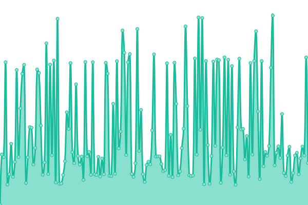
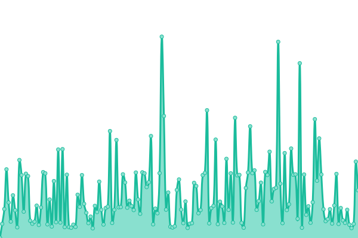
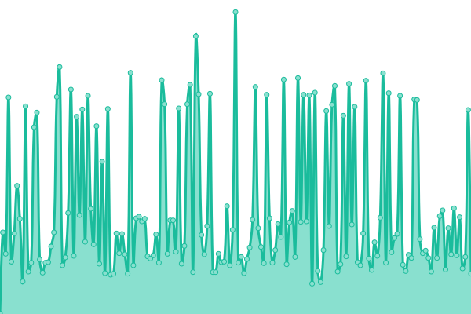
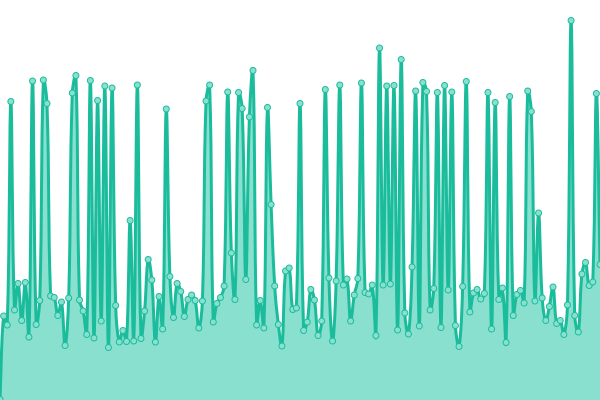
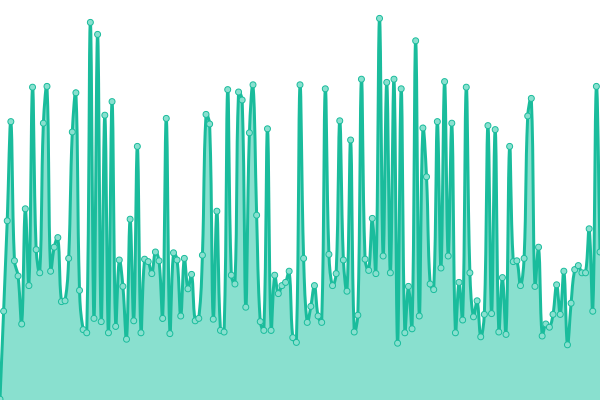

# [📈 Live Status](https://demo.upptime.js.org): <!--live status--> **🟩 All systems operational**

This repository contains the open-source uptime monitor and status page for [Pedro Rocha de Souza](https://demo.upptime.js.org), powered by [Upptime](https://github.com/upptime/upptime).

With [Upptime](https://upptime.js.org), you can get your own unlimited and free uptime monitor and status page, powered entirely by a GitHub repository. We use [Issues](https://github.com/0ur0b0r0s/upptime/issues) as incident reports, [Actions](https://github.com/0ur0b0r0s/upptime/actions) as uptime monitors, and [Pages](https://demo.upptime.js.org) for the status page.

<!--start: status pages-->
<!-- This summary is generated by Upptime (https://github.com/upptime/upptime) -->
<!-- Do not edit this manually, your changes will be overwritten -->
<!-- prettier-ignore -->
| URL | Status | History | Response Time | Uptime |
| --- | ------ | ------- | ------------- | ------ |
|  [Elos (elos.vc)](https://elos.vc) | 🟩 Up | [elos-elos-vc.yml](https://github.com/mconf/upptime/commits/HEAD/history/elos-elos-vc.yml) | 

 267ms
     
 | 

<a href="https://status.h.elos.dev/history/elos-elos-vc">100.00%</a>
    

|  [Elos API](https://api.elos.vc) | 🟩 Up | [elos-api.yml](https://github.com/mconf/upptime/commits/HEAD/history/elos-api.yml) | 

 170ms
     
 | 

<a href="https://status.h.elos.dev/history/elos-api">100.00%</a>
    

|  [Mconf](https://mconf.com) | 🟩 Up | [mconf.yml](https://github.com/mconf/upptime/commits/HEAD/history/mconf.yml) | 

 201ms
     
 | 

<a href="https://status.h.elos.dev/history/mconf">100.00%</a>
    

|  [Elos (Homologação)](https://h.elos.dev) | 🟩 Up | [elos-homologacao.yml](https://github.com/mconf/upptime/commits/HEAD/history/elos-homologacao.yml) | 

 278ms
     
 | 

<a href="https://status.h.elos.dev/history/elos-homologacao">100.00%</a>
    

|  [Elos API (Homologação)](https://api.h.elos.dev) | 🟩 Up | [elos-api-homologacao.yml](https://github.com/mconf/upptime/commits/HEAD/history/elos-api-homologacao.yml) | 

 190ms
     
 | 

<a href="https://status.h.elos.dev/history/elos-api-homologacao">100.00%</a>
    

<!--end: status pages-->

[**Visit our status website →**](https://demo.upptime.js.org)

## 📄 License

- Powered by: [Upptime](https://github.com/upptime/upptime)
- Code: [MIT](./LICENSE) © [Pedro Rocha de Souza](https://demo.upptime.js.org)
- Data in the `./history` directory: [Open Database License](https://opendatacommons.org/licenses/odbl/1-0/)
